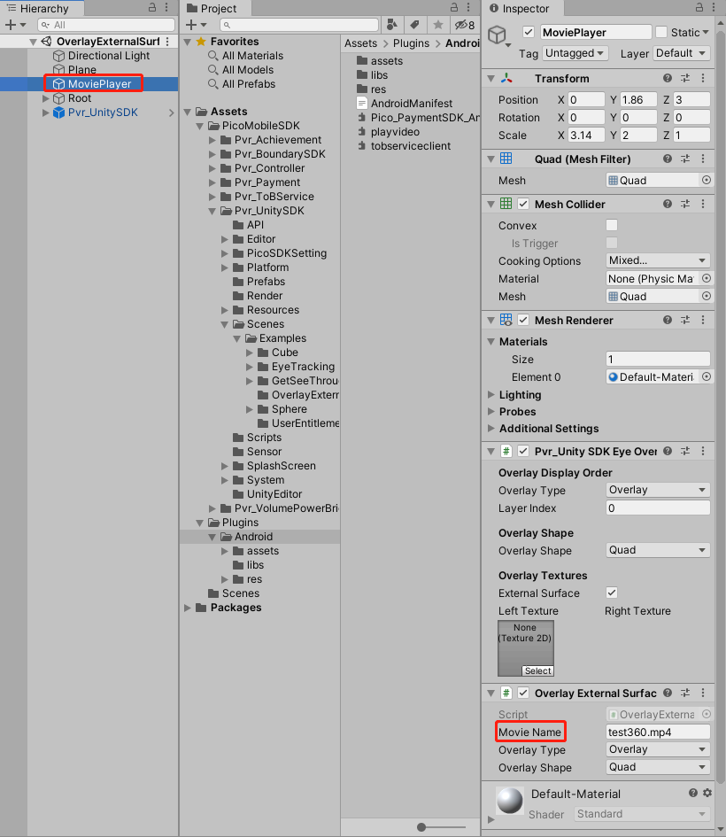
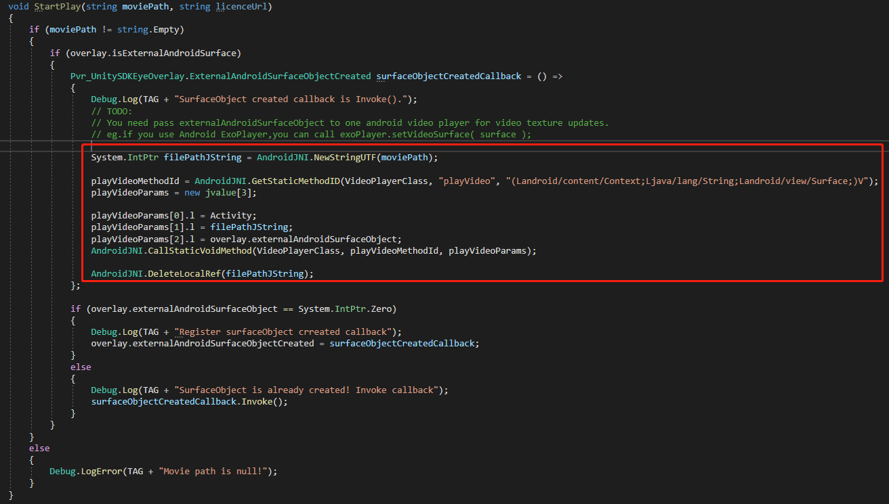

# External Surface Demo

- If you have any questions/comments, please visit [**Pico Developer Answers**](https://devanswers.pico-interactive.com/) and raise your question there.

**External Surface Demo**

- This demo shows how to use `External Surface`. Please refer to the [Scene](https://github.com/picoxr/External-Surface-Demo/blob/main/Assets/PicoMobileSDK/Pvr_UnitySDK/Scenes/Examples/OverlayExternalSurface.unity) and [Script](https://github.com/picoxr/External-Surface-Demo/blob/main/Assets/PicoMobileSDK/Pvr_UnitySDK/Scenes/Examples/OverlayExternalSurface/OverlayExternalSurfaceDemo.cs).

- If you want to experience the [Test.apk](https://github.com/picoxr/External-Surface-Demo/blob/main/Test.apk), you need to configure as shown as below:
  
  
  
- 

  

- Note: This Demo is implemented with `Unity 2019.4.23`, and higher Unity versions are recommended.
